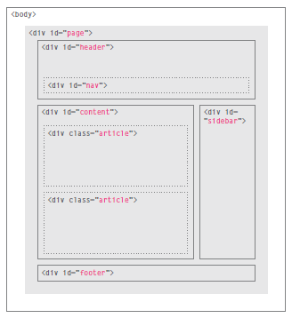
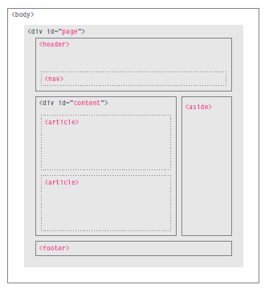

[HOME](https://dinaalsaid.github.io/reading-notes/)  &nbsp; [NEXT](https://dinaalsaid.github.io/reading-notes/) 


# Introduction 
## Web pages

Most web pages these days are structured using HTML and styled using CSS, that are recieved by a host from a server, in which the browser at the host interprets to present a web page for the user.
For small websites this is enough usually, but for larger websites databases for storing and handling users' information is required.

## Website Structure and HTML

**HTML** describes the structure of a web page using tags to make it more readable.
for example if we want to create a heading (bold and larger font size) we can use the following code:

````HTML
    <h1> Heading content </h1>
````
An HTML element is made up of an opening and a closing tag and the content inside.


Some elements do not contain content therefore only consist of one tag (do not have a closing tag)


Elements have attributes to describe them. for example:

````HTML
    <p lang="fr">Paragraphe en Français</p>
````

<!-- ## HTML versions

* HTML4 : released in 1997
* XHTML : releaased in 2000
* HTML5 : released in 2000 and is the one commonly used recently. -->
The versions are indicated in the beginning of an HTML file through the DOCTYPE tag.

## Block and Inline elements 

&nbsp;|Block element|Inline element
--------|------|-----------
definition|starts on a new line | continues on the same line as neighbouring elements.
examples| h1, p, ul and li |a, b, em, and img
useful elementts|div element to group inline and block elements |span element to group inline elements

## Some escape charecters
Escape characters are used to include special characters in your pages such as <, >, and ©.

* `&lt;` or `&#60;` for <
* `&amp;`; or `&#38;` for &
* `&copy;` or `&#169;` for copyright symbol
* `&gt;` or `&amp;` for >

## HTML 5 layout 

**traditional HTML**| **HTML5**
------|--------
|


## Getting started in building websites

#### important things to consider when building a site 

* The website's target audience : - age - gender -region  - individual or company 
* The reason of visit : design content according to the motivation and goals of the visitors
* what do they want to achieve 
* what info they need : on the product or the organization 
* how often do they visit 

### design 

After figuring out the content the **first** step is to create a site map of how the pages connectd and grouped together to make navigation easier and more effective.
when designing site navigation make sure the design is:
 * concise 
 * clear 
 * selective
 * in context 
 * interactive
 * consistent

**second** step is to create a wireframe of how the site will look like, nothing fancy just a simple sketch.
**lastly** combine the content and the design using HTML to create the final pages layout.


## How old browsers understand new elements

adding the following lines to your CSS file and HTML file will solve the problem.
```CSS
header, section, footer, aside, nav, article, figure
{
display: block;}
```
```HTML
<!--[if lt IE 9]>
<script src="http://html5shiv.googlecode.com/svn/
trunk/html5.js"></script>
<![endif]-->
```

## Scripts 

Scripts are series of instructions that a computer can follow to achieve a goal.