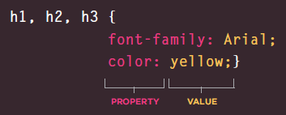

[PREVIOUS](https://dinaalsaid.github.io/reading-notes/class-01) &nbsp;[HOME](https://dinaalsaid.github.io/reading-notes/)  &nbsp; [NEXT](https://dinaalsaid.github.io/reading-notes/class-03) 

# Introduction follow up

## HTML text
There are two kinds of markup in HTML:
* structural markup :used for structuring a page **ex:** div, span
* Semantic markup :describes the content **ex:** p, img, header

an element can be both semantic and structural.

text element|tag
-----|-------
headings|`<h1></h1>`
paragraphs|`<p></p>`
bold|`<b></b>`
italic|`<i></i>`
subscript|`<sub></sub>`
superscript|`<sup></sup>`
line break|`<br/>`
horizantal rule|`<hr />`
emphasis|`<em></em>`
strong|`<strong></strong>`
abbreviation|`<abbr></abbr>`
definition|`<dfn></dfn>`
strikethrough|`<s></s>`

## CSS
CSS is used to style the html pages to make them look more attractive.

CSS sees the HTML page as boxes (or elements) and associate rules to these boxes in order to change how they look.
The boxes are targeted using **selectors**, and rules are declared by changing the values of the element **properties**.


there are three ways to apply CSS to an HTML file:

* link using the link tag/element (external)
* write CSS code in a style tag (internal)
* from the style attributes in any element’s tag

Using external CSS stylesheet will give you the advantage of applying the same style to all you website pages, less code to write, and faster site load.

#### CSS selectors 
types of selectors:
* universal: `* {} `
* type: `p, h1, div{} `
* class: `.className1 {} `
* ID: `#IDname1 {} `
* child: `li >a {} `
* descendant: `p a {} `

#### cascading rules
If one element has more than one CSS rule linked to it, the final applied rule is considered by:
* if two selectors are identical the last rules are applied.
* if one selector is more specific than the others its rules are applied. **ex**: `p li` selector is more specific than `li` selector.
* if a rule is followed by `!important` it will be applied.

some rules are inhereted by default some can be forced to be inhereted from a parent element to a child element.

## JavaScript
### Data Types
These are the most common and basic data types:
* Numeric
* String
* Boolean
* Array
* Object
* Null and Undefined

### Variable names
rules to naming variables:
* does not start with a number
* can contain letters,numbers, dollar sign, or an underscore but not a dash or a period.
* cannot use keywords or reserved words.
* all variables are case sensitive
* Use a name that describes the kind of information that the variable stores
* use a capital letter for the first letter of every word after the first word if the name has more than one word (this is referred to as camel case).

### Functions
Are a group of statments to perform a specific task.
They can be reused throughout the code. They are not always excuted when the page is loaded.

Functions have parameters that need to be provided when excuting/calling the function and a return value that is the answer to the function call.

* writing a function
A fuvtion has the following general structure.

`````
function functionName (parmeter1 ,parameter2,..etc){
	//JS code for processing data
	return val1;
}
`````

* calling a function 
Can be called/excuted by typing the function name.

````
functionName(x,y,...);
````

* storing a return value
the return value of the fuction can be stored in a 
variable for example

````
var var1 = FunctionName();
````

### Logical operators 
The logical operators are :
* `==` :equal to.
* `!=` :not equal.
* `===` :strict equal (checks the value and the type).
* `!==` :strict not equal.
* `>` , `<` :greater than **and** less than.
* `>=` , `<=` :greater than or equal **and** less than or equal.
* `&&` :AND.
* `||` :OR.
* `!` :NOT.
you can combine these operators to create more complex logical expressions ( note that the whole expression returns a single value true or false)

### if statements
if statements are used to check a certain expression to be true or false and based on that perform a task.

````JavaScript
    if (var1 == 1){
        //first statement 
        var2 =20;
    } else {
        //second statement
        var2= 90;
    }
````
If the condition is true the first statement will be excuted if it is false the second one will be
 
### loops
* for loops
For uses a counter as a condition
to run code a number of times until the 
condition is false.

````
for (initialize, condition, update){}
````


* while loop 
while runs the code block until the condition is false.
It does not initialize or update the loop 
counter (unless you write the initialization and update 
by yourself in the code block).


````
while (condition){}
````


