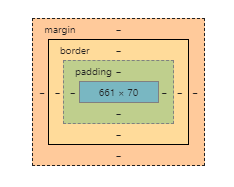

[PREVIOUS](https://dinaalsaid.github.io/reading-notes/class-02) &nbsp;[HOME](https://dinaalsaid.github.io/reading-notes/)  &nbsp; [NEXT](https://dinaalsaid.github.io/reading-notes/) 

## follow up

### types of lists

list type|tags
-----|-----
ordered| `<ol> <li>item</li> </ol>`
unordered|`<ul> <li>item</li> </ul>`
definition|`<dl> <dt>term</dt> <dd>definition</dd> </dl>`

Lists can be nested inside one another.

### boxes 
There are many properties for boxes that we can tweak to achieve the desired look for the elements on the page.

* **width and height** you can control them by setting the desired value and choosing the suitable unit(px, in, pt and so on).
* You can set limits to how wide or narrow you want the box to be using **max-width and min-width**
* if the content is too large for the box you can set the **overflow** value to either hidden or scroll.
* **padding** is the space between the content and the border.
* **border** thickness can be changed to user liking. `margin: top right bottom left;` or `margin :horizantal vertical;`
* **margin** is the space between the borders of two elements



* **display** property can be used to hide or show boxes, also change the boxes to inline or block or inline-block.
* **visibility** property can also hide or show the boxes.

### Switch statement
switch statements allow you to compare a value against possible outcomes (and also provides a default option if none match).

```JavaScript
    switch(condition){
        case val1:
            //do something;
            break;
        case val2:
            //do something else;
            break;
        .
        .
        .
        default:
            //do something;
    }
```
It is important when writing a condition to keep on mind Truthy and Faulty expressions (expressions that may not appear to be true or false directly).
**ex:** NaN (not a number), null, 0 and undefined are  considered false 


### for loops

For uses a counter as a condition
to run code a number of times until the 
condition is false.

````
for (initialize, condition, update){}
````


### while loop 

````
while (condition){}
````

while runs the code block until the condition is false.
It does not initialize or update the loop 
counter (unless you write the initialization and update 
by yourself in the code block).

### Do while 
Do while loop will go through the loop once before checking the condition then continue as while loop does.


